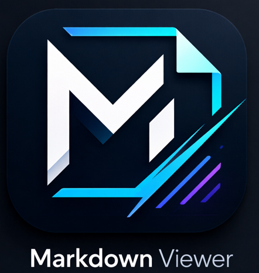

# **Markdown** <span style="font-weight:normal">Viewer</span>

ローカルで動作する軽量な Markdown ビューアです。
Python の内蔵 HTTP サーバーを使い、ブラウザ上で Markdown ファイルを表示します。
インターネット接続不要・インストール不要（EXE版）で使えます。

## 特徴

- **フォルダ / ファイルを開く** — ブラウザの File System Access API でローカルファイルを直接読み込み
- **サイドバーのファイルツリー** — フォルダ内の全ファイル・全フォルダを一覧表示、ディレクトリを展開/折りたたみ、幅をドラッグで調整可能
- **シンタックスハイライト** — highlight.js による言語別コードカラーリング
- **Mermaid ダイアグラム** — コードブロック ` ```mermaid ` を自動レンダリング
- **ダーク / ライトテーマ** — OS 設定に連動、手動切替も可能
- **自動リロード** — ファイルの変更を 1.5 秒ごとに検出して自動更新
- **F5 再読み込み** — サイドバーのツリーと表示中のファイルを再読み込み（ページリロードは行わない）
- **新しいタブで開く** — 右クリックメニューからファイルを別タブで表示
- **システムトレイ常駐** — タスクバー右下に常駐し、右クリックで操作・終了
- **スタンドアロン EXE** — PyInstaller でビルドした `mdviewer.exe` 単体で動作

## 対応ファイル形式

`.md` / `.markdown` / `.mdown` / `.mkd`

上記拡張子のファイルのみ開いて表示できます。サイドバーには全ファイル・全フォルダが表示されますが、Markdown 以外のファイルをクリックしても何も起こりません。

## サイドバーの表示対象

### 表示されるファイル・フォルダ

**すべてのファイルとフォルダ**が表示されます。`.gitignore` や `.env` などのドットファイル・ドットフォルダも含みます。

### ファイルアイコン

| 種別 | アイコン |
|------|---------|
| Markdown ファイル | 📄 |
| それ以外のファイル | （アイコンなし） |
| フォルダ | 📁 |

## 必要環境

| 用途 | 要件 |
|------|------|
| スクリプト実行 | Python 3.8 以上 |
| EXE ビルド | Python 3.8 以上 + PyInstaller + pystray + Pillow |
| 表示 | Chrome / Edge (File System Access API 対応ブラウザ) |

## 使い方

### スクリプトとして実行

```bash
python -m venv .venv
.venv\Scripts\activate
pip install -r requirements.txt
python viewer.py
```

起動後、ブラウザが自動的に `http://127.0.0.1:8765` を開きます。

### フォルダを開く vs. ファイルを開く

| 操作 | 動作 |
|------|------|
| **フォルダを開く** | フォルダ内の全ファイル・全フォルダをサイドバーに一覧表示し、最初の Markdown ファイルを自動で開く。相対リンク・画像も正しく表示される。すでにファイルを表示中の場合は閉じてからフォルダを開く。 |
| **ファイルを開く** | 単一の Markdown ファイルのみ表示。サイドバーにもそのファイルだけ表示される。**相対リンクや相対パスの画像は機能しない**（フォルダへのアクセス権がないため）。 |

> 相対リンク・画像を含む Markdown を閲覧する場合は、**フォルダを開く** を使ってください。

### F5 キー

F5 を押すと、ページリロードは行わず以下を再実行します。

1. サイドバーのフォルダツリーを再スキャンして更新（ファイル・フォルダの追加・削除を反映）
2. 表示中のファイルを再読み込みして再レンダリング

### EXE をビルドして実行

```powershell
powershell -NoProfile -ExecutionPolicy Unrestricted .\build.ps1
```

`dist\mdviewer.exe` が生成されます。ダブルクリックで起動できます。

## システムトレイの操作

mdviewer.exe を起動すると、Windowsタスクバー右下の通知領域（システムトレイ）に  のアイコンが表示されます。

| 操作 | 動作 |
|------|------|
| アイコンをダブルクリック | ブラウザでビューアを開く |
| アイコンを右クリック → **ブラウザで開く** | ブラウザでビューアを開く |
| アイコンを右クリック → **終了** | サーバーを停止してプロセスを終了 |

ブラウザの ☰ メニューからも **終了** を選択できます。

> トレイアイコンが見つからない場合は、タスクバー右下の「∧」をクリックして隠れたアイコンを表示してください。

## ファイル構成

```
mdviewer/
├── viewer.py        # HTTP サーバー + システムトレイ
├── index.html       # フロントエンド (SPA)
├── requirements.txt # Python 依存パッケージ
├── viewer.spec      # PyInstaller ビルド設定
├── build.ps1        # ビルドスクリプト (PowerShell)
├── icon.ico         # アプリアイコン
├── make_icon.py     # アイコン生成スクリプト
├── vendor/          # バンドル済みライブラリ
│   ├── marked.min.js
│   ├── highlight.min.js
│   ├── mermaid.min.js
│   └── css/
│       ├── github.min.css
│       └── github-dark.min.css
└── sample/          # サンプル Markdown ファイル
```

## 使用ライブラリ

| ライブラリ | 用途 |
|-----------|------|
| [marked](https://marked.js.org/) | Markdown → HTML 変換 |
| [highlight.js](https://highlightjs.org/) | シンタックスハイライト |
| [Mermaid](https://mermaid.js.org/) | ダイアグラム描画 |
| [pystray](https://github.com/moses-palmer/pystray) | システムトレイアイコン |
| [Pillow](https://python-pillow.org/) | アイコン画像処理 |

すべてのフロントエンドライブラリは `vendor/` にバンドルされており、オフラインで動作します。

## セキュリティ

- サーバーは `127.0.0.1`（ループバック）のみでリッスンし、外部からのアクセスを受け付けません。
- `/vendor/` 以外のパスへのアクセスはすべて拒否します（パストラバーサル対策済み）。

## ライセンス

MIT
