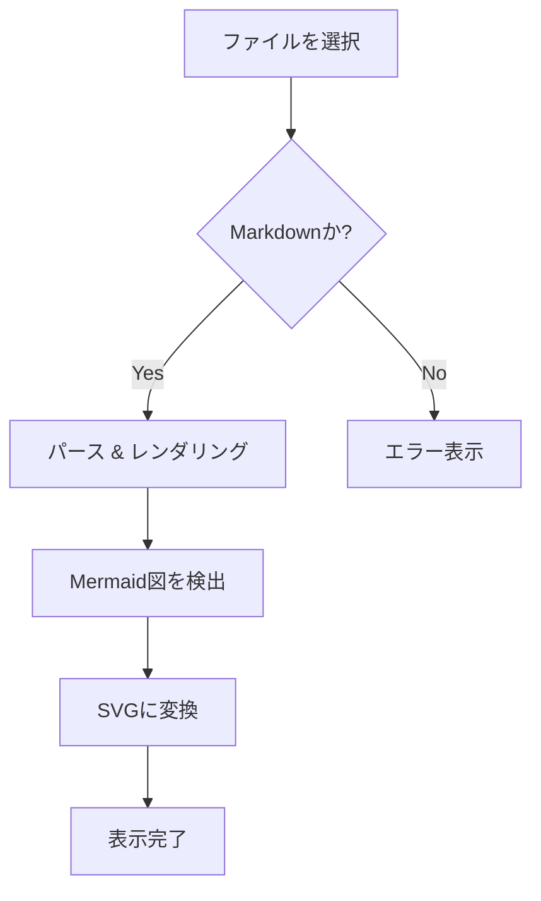
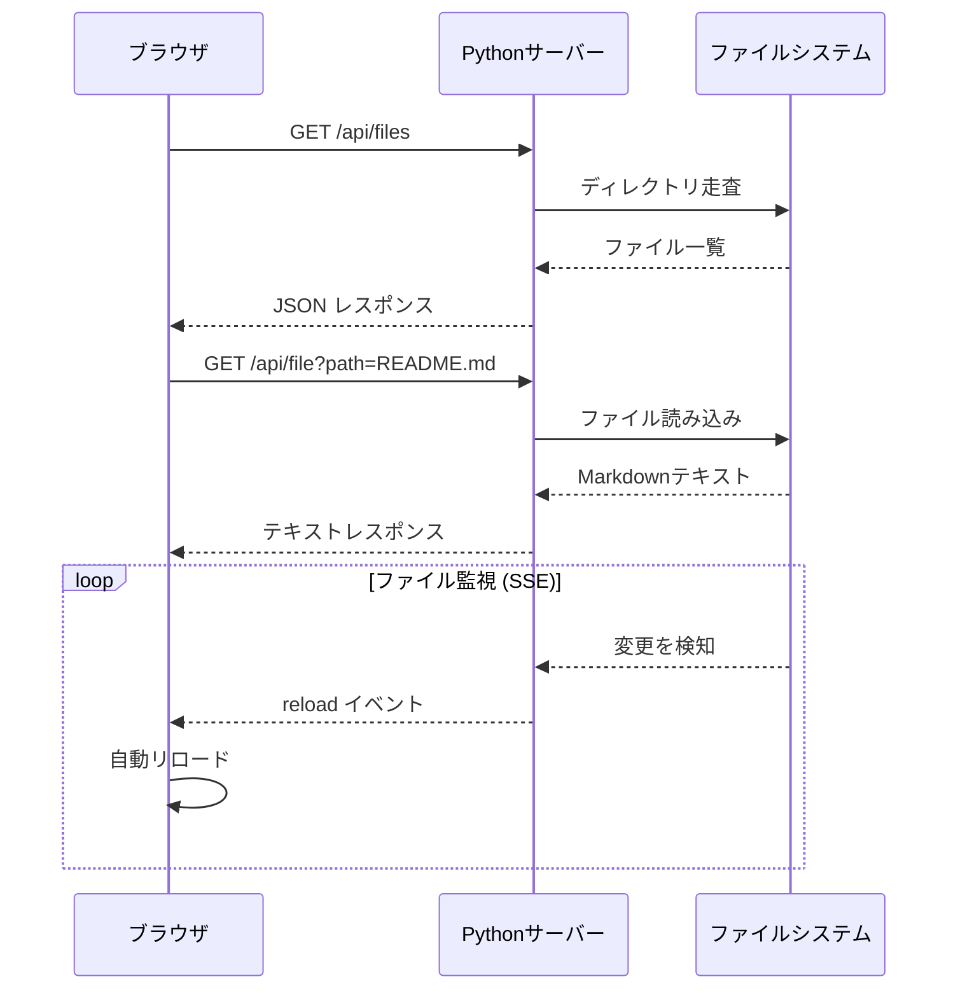
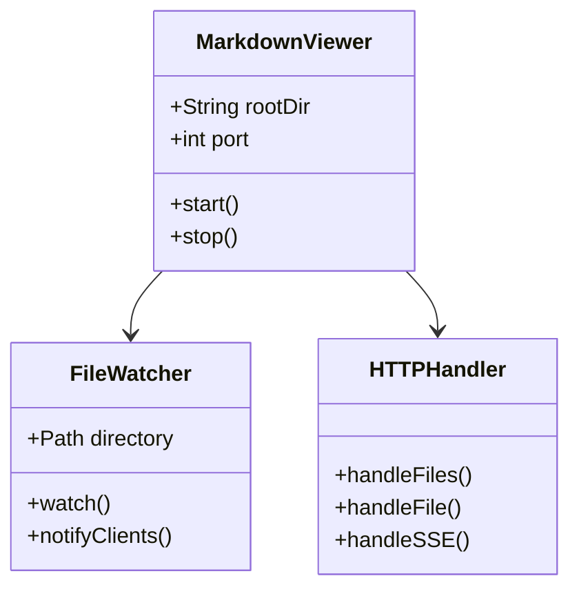

# Markdown Viewer サンプル

軽量Markdownビューアーのデモファイルです。

## 見出し

### 3階層目の見出し

#### 4階層目の見出し

---

## テキスト装飾

**太字**、*イタリック*、~~打ち消し~~、`インラインコード`

> これはブロッククォートです。
> 引用文を表示するのに使います。

---

## リスト

### 箇条書き

- アイテム1
- アイテム2
  - ネストされたアイテム
  - もう一つ
- アイテム3

### 番号付きリスト

1. 最初のステップ
2. 次のステップ
3. 最後のステップ

---

## コードブロック

```python
def fibonacci(n: int) -> int:
    if n <= 1:
        return n
    return fibonacci(n - 1) + fibonacci(n - 2)

for i in range(10):
    print(f"fib({i}) = {fibonacci(i)}")
```

```bash
# サーバー起動
python viewer.py ./sample
```

---

## テーブル

| 言語       | パラダイム     | 用途              |
|------------|---------------|-------------------|
| Python     | マルチパラダイム | AI / スクリプト   |
| JavaScript | プロトタイプ   | Web フロントエンド |
| Rust       | 所有権モデル   | システム / WebAssembly |
| Go         | 並行指向       | バックエンド API  |

---

## Mermaid ダイアグラム

### フローチャート



### シーケンス図



### クラス図



---

## リンク・画像

[marked.js ドキュメント](https://marked.js.org/)
[mermaid.js ドキュメント](https://mermaid.js.org/)

---

## 数式っぽい表現

コードブロックで数式を表現することもできます:

```
E = mc²
∑(i=1 to n) i = n(n+1)/2
```
