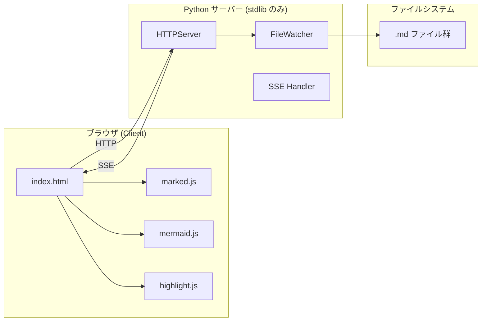

# アーキテクチャ

## 全体構成

## 依存関係

| レイヤー   | ライブラリ       | バージョン | 読み込み方式 |
|-----------|-----------------|-----------|-------------|
| Markdown  | marked.js       | 13.x      | CDN         |
| 図        | mermaid.js      | 11.x      | CDN         |
| コード強調 | highlight.js    | 11.x      | CDN         |
| サーバー  | Python stdlib   | 3.8+      | 組み込み     |

外部への依存は**CDN のみ**（オフライン環境では動作しません）。
